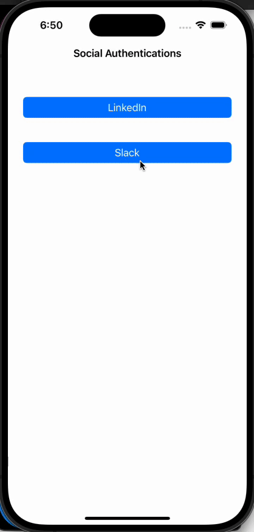

# iOS Social Authentication

This is a simple iOS Swift application that demonstrates how to integrate LinkedIn and Slack login functionality using auth api and get all user informations.

## Table of Contents 

- [Demo UI](#demo)
- [Prerequisites](#prerequisites)
- [Features](#features)
- [Installation](#installation)
- [Usage and Configuration](#usage-and-configuration)
- [Contributing](#contributing)
- [Need Help / Support?](#need-help)
- [Collection of Components](#collection-of-Components)
- [License](#license)
- [Acknowledgements](#acknowledgements)
- [Keywords](#keywords)

# Demo UI 📱





## Prerequisites

Before you get started, make sure you have the following installed on your development machine:

- Xcode (latest version)
- An active LinkedIn Developer App
- An active Slack App with OAuth 2.0 setup

# Features 🥳

App has main feature as:

* Social login feature.
* Demo has linkedin and slack login.
* Fully customization available.
* Not any third party dependency.
* Support latest iOS 17.0

# Installation 💾

The instructions on how to install or run this demo:

* Clone the repository.
* Open the project in Xcode.
* Build and run the project.

# Usage & Configuration 👩🏾‍🔬

## LinkedIn Configuration
To enable LinkedIn login, follow these steps:

Visit the LinkedIn Developer [Console](https://www.linkedin.com/developers/apps) and create a new app.
Note down your Client ID and Client Secret.
Open `LinkedInManager` file to add the following entries like:


```swift
struct LinkedInConstants {
    
    static let CLIENT_ID = "<linkedin_client_id>"
    static let CLIENT_SECRET = "<linkedin_client_secret>"
    static let REDIRECT_URI = "<your_domain>.oauth/oauth"
    static let SCOPE = "r_liteprofile%20r_emailaddress"
    
    static let AUTHURL = "https://www.linkedin.com/oauth/v2/authorization"
    static let TOKENURL = "https://www.linkedin.com/oauth/v2/accessToken"
}

```

## LinkedIn Usage


```swift

    @IBAction func btnLinkedinLogin(_ sender: UIButton) {
        let vc = LinkedInManagerViewController()
        vc.delegate = self
        vc.linkedInAuthVC(parent: self)
    }

```


## Slack Configuration
To enable Slack login, follow these steps:

Visit the Slack API [Console](https://api.slack.com/apps) and create a new app.
Note down your Client ID and Client Secret.
Open `SlackManager` file to add the following entries like:


```swift
struct SlackConstants {
    
    static let CLIENT_ID = "<client_id>"
    static let CLIENT_SECRET = "<client_secret>"
    static let REDIRECT_URI = ""
    static let SCOPE =   "identity.basic,identity.email,identity.avatar"
    
    static let AUTHURL = "https://slack.com/oauth/v2/authorize"
    static let TOKENURL = "https://slack.com/api/oauth.v2.access"
    static let USERINFO = "https://slack.com/api/users.identity"
}

```

## Slack Usage


```swift

        @IBAction func btnSlackLogin(_ sender: UIButton) {
        let vc = SlackManagerViewController()
        vc.delegate = self
        vc.slackAuthVC(parent: self)
    }

```

Now that you have configured the LinkedIn and Slack credentials, you can run the application. This demo app provides a simple interface to login with LinkedIn and Slack. After successful login, it will display basic user information.


# Contributing

- Created something awesome, made this code better, added some functionality, or whatever (this is the hardest part).
- [Fork it](http://help.github.com/forking/).
- Create new branch to contribute your changes.
- Commit all your changes to your branch.
- Submit a [pull request](http://help.github.com/pull-requests/).


# Need Help? 

We also provide a free, basic support for all users who want to use this coordinator master demo in project. In case you want to customize this demo input to suit your development needs, then feel free to contact our [iOS Developers](https://www.weblineindia.com/hire-ios-app-developers.html).

# Collection of Components

We have built many other components and free resources for software development in various programming languages. Kindly click here to view our [Free Resources for Software Development.](https://www.weblineindia.com/software-development-resources.html)

# Changelog

Detailed changes for each release are documented in [CHANGELOG](./CHANGELOG).

# License 📃

This project is licensed under the MIT License. Feel free to use, modify, and distribute the code as permitted by the license.

# Acknowledgements

This app was created using SwiftUI and leverages various libraries and resources. We would like to acknowledge and express our gratitude to the following:
* SwiftUI: Apple's declarative framework for building user interfaces.
* Xcode: Integrated development environment (IDE) provided by Apple.
* Open-source libraries: Various open-source libraries and frameworks used in the project.
* Community contributors: Contributors who have provided support, bug fixes, and enhancements.

# Keywords

Social login Master, iOS Social Authentication, LinkedIn login Component, Slack Login Component, Swift5, iOS 17, WeblineIndia
